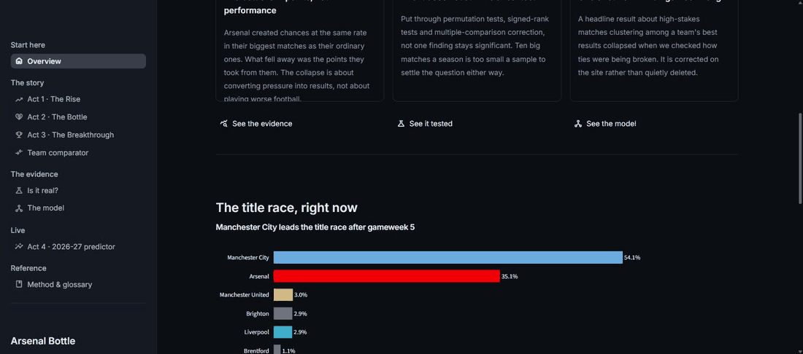
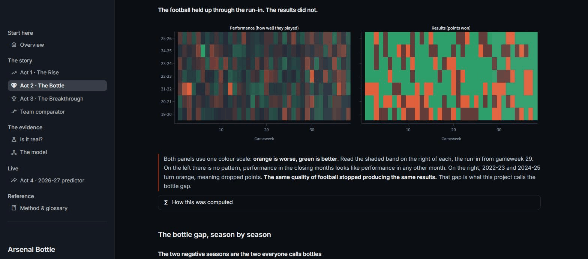

# Arsenal Bottle

Did Arsenal bottle the title? Seven seasons of Premier League match data, tested until the
finding broke, plus a Monte Carlo simulator for the season being played right now.

**[Live site → arsenal-bottle.streamlit.app](https://arsenal-bottle.streamlit.app/)**



Arsenal led the Premier League for long stretches of 2022-23, 2023-24 and 2024-25, won none of
them, then won it in 2025-26. The popular explanation is that they choke under pressure. This
project tries to prove that, fails, and publishes the failure instead of hiding it.

That is the point of it. Most of what follows is a negative result, arrived at honestly and
shown in full.

---

## What the data actually said

**Attack holds up. Defence softens. Neither difference is big enough to trust.** Across seven
seasons Arsenal create slightly more in their ten highest-pressure matches than in their
ordinary ones (1.84 xG against 1.78) and concede noticeably more (1.32 xGA against 1.05). That
defensive gap is the largest effect anywhere in the analysis, and it still fails every
corrected test.

**The seasons with a reputation are not the worst ones.** Measuring each season against its own
average points per match, three of Arsenal's seven are negative. The two everyone calls bottles,
2022-23 and 2024-25, are the two mildest at -0.11 and -0.05. The largest drop by far is 2021-22
at -0.62, a season nobody remembers as a collapse.

| Season | 19-20 | 20-21 | 21-22 | 22-23 | 23-24 | 24-25 | 25-26 |
|---|---|---|---|---|---|---|---|
| Points per match vs own average | +0.23 | +0.19 | **-0.62** | -0.11 | +0.16 | -0.05 | +0.16 |

The run-in, gameweeks 29 to 38, tells the same story less neatly than the narrative wants.
2022-23 took 15 of 30 points and 2024-25 took 19, four of them dropped in draws. But 2021-22
also took 15, and 2023-24 took 25 of 30 with a single defeat, which is not a bottle by any
reading. Manchester City were simply flawless that year.

**One of this project's own headline findings was wrong.** An earlier version reported that
high-pressure matches cluster among a team's best results at more than double the chance rate,
which would have meant the pressure metric was structurally biased. It was an artifact of tie
sorting. Points can only be 0, 1 or 3, so "the best ten results of a season" is decided almost
entirely by how ties are broken, and a chronological tie-break sorts late-season matches, which
is when high-pressure matches happen, into the best bucket by construction.

| Tie-break | Overlap ratio |
|---|---|
| Chronological, as originally run | 5.89 |
| Reversed | 0.39 |
| Random | 2.69 (chance is 2.63) |

Broken tie-free, the win-rate difference is +0.008. The correction is published on the site
next to the original claim rather than quietly deleted, because catching your own error is
worth more than never showing one.



*Left, how well Arsenal played, match by match. Right, the points they took. One colour scale,
orange worse and green better. The run-in only changes colour on the right.*

---

## Does any of it survive a real test

No. Not one result clears multiple-comparison correction.

| Test | Result |
|---|---|
| Arsenal xG, big matches against normal | p = 0.665 |
| Arsenal xGA | p = 0.031, Bonferroni 0.247 |
| Manchester United xGA | p = 0.032, Bonferroni 0.260 |
| Bottle gap, permutation test over 28 team-seasons | 1 significant before correction, 0 after |
| Wilcoxon signed-rank, pooled | p = 0.674 |
| Kruskal-Wallis across the four clubs | H = 0.449, p = 0.930 |

The reason is sample size, not absence of an effect. Ten high-pressure matches a season against
twenty-eight ordinary ones means these tests can only detect a Cohen's d of 1.06 or larger. The
effects actually observed run from 0.03 to 0.31. The honest conclusion is not "the bottle is
fake", it is that this data cannot settle it either way, and a project claiming otherwise would
be overselling.

The site hands the reader the knife. A big match is defined as the top 25% of a season by
pressure score, and nothing makes 25% correct. A control on the page moves it between 15% and
40% and recomputes the chart live. At 15% and 20% the 2024-25 gap flips positive, so half the
evidence for the bottle rests on an arbitrary cut. Rerunning the entire test battery at every
threshold changes nothing that matters: zero results survive correction anywhere between 15%
and 40%.

---

## The pressure score

"Big match" needed a definition that was not hand-picked, so matches are scored from 0 to 1 on
a continuous `stakes_intensity`.

Time pressure is a sigmoid rather than a straight line, because a one-point gap in August is not
a one-point gap in April. Its midpoint is gameweek 22, which is roughly when a gap stops being
recoverable in a good week. The whole score is divided by its own gameweek-38 maximum so the
theoretical ceiling is exactly 1.0 and the number is interpretable.

The gap to a target is measured against `(38 - gameweek + 1) * 3`, the points actually still
available, instead of a fixed constant. A ten-point gap at gameweek 10 and the same gap at
gameweek 35 are not the same situation, and a dynamic denominator says so without anyone
choosing a magic number.

Four competitive boundaries are scored and the strongest one wins: the title at full weight,
relegation at 0.8, the Champions League place at 0.75, the Europa place at 0.5. Without this,
a club fighting for fifth or fighting the drop would score near zero and be treated as playing
a dead rubber. Form and rivalry are folded in on top, because being out of form, facing a rival
and needing the points compounds.

The **Drop Index** measures the other half: how far a performance fell below that team's own
season average, as the mean of the xG shortfall and the xGA excess. It uses expected goals
rather than actual ones deliberately, so that one world-class save or one post does not get read
as a collapse in process.

---

## The live predictor

The current season is simulated 10,000 times from the live table. Every remaining fixture gets
win, draw and loss probabilities from the model, one uniform draw decides it, and the final
table is counted up. Outputs are title, top-four and relegation probabilities plus a points
range for all 20 clubs. Runs are vectorised, so all 10,000 seasons take about two seconds.

10,000 is enough. At 1,000, 10,000 and 50,000 runs Manchester City's title probability comes out
at 53.3%, 54.3% and 54.6%, and the order of the table never changes.

There is a published track record. Replaying the completed 2025-26 season with a model that
never saw it:

| Frozen at | Champion's title probability | Clubs inside their 90% range |
|---|---|---|
| Gameweek 20 | 85.7% | 17 of 20 |
| Gameweek 5 | 29.7% | 14 of 20 |

Given half a season it works, and it called the real champion with the real median points total.
Given five matches it is weak, because form is read from a five-match window that resets every
August, so in September a club's entire profile is five games. The three clubs it missed at
gameweek 20 were Bournemouth, Manchester United and Tottenham, and they are named on the site
rather than averaged away.

Form is frozen for the rest of the simulated season, since in-season refitting was tested and
did not help. Pressure is not frozen: it is recomputed at every simulated gameweek from the
simulated table, because it describes where a club sits, which is exactly what the simulation
is producing.

---

## The model

Multinomial logistic regression, 11 features, 4,894 training rows from completed seasons.
Compared against two tree models and a no-information baseline on an identical forward-in-time
holdout, the whole of 2025-26:

| Model | Log loss | Accuracy | Brier |
|---|---|---|---|
| Logistic regression | **1.0362** | 48.9% | 0.623 |
| XGBoost | 1.0719 | 47.1% | 0.644 |
| Random forest | 1.0873 | 44.9% | 0.655 |
| Always predict the base rate | 1.0984 | 36.0% | 0.666 |

The simplest model beating both tree models is a real result rather than a disappointment: there
is not enough signal in 5,320 matches for that flexibility to pay for itself. Walk-forward
validation across five seasons beats the baseline every time.

Log loss is the headline metric, not accuracy, because the simulator draws from these
probabilities and a confident wrong answer costs more than a hedged one. Accuracy near 49% also
reads worse than it is: the league-wide outcome split is roughly 38% win, 24% draw, 38% loss,
so the bar to clear is 36%, not 50%.

One model covers all 20 clubs rather than a specialist model for the four tracked ones. The
reason is measurable: asked to predict a perfectly average match from its own training data,
a four-team model says 60.6% win and an all-20 model says 37.5%, a 23-point gap before a single
feature is read. The four clubs won about 59% of their matches, so a model fitted only to them
carries that into its intercept and would quietly inflate them inside a 20-team simulation.

**Fourteen documented dead ends.** Class weighting, a two-stage draw classifier, a Poisson goals
model, hyperparameter tuning, match-level retraining, recency weighting, an `is_promoted` flag,
separate attack and defence terms, and a combined prototype, roughly 1,100 model fits in total.
Exactly one addition earned its place, head-to-head record, worth 0.009 log loss.

The most useful of the failures: every attempt to fix the model's reluctance to predict draws
made it worse. Class weighting raised draw recall and raised log loss at the same time, three
separate times, for three different algorithms. And when a tuned decision rule was given a free
hand to multiply the draw probability by anything up to 3.6x, it chose 1.00 to 1.05. An
optimiser explicitly allowed to call more draws declined to, which is stronger evidence than any
confusion matrix that draws are not identifiable from these features. All thirteen rejects are
on the site with their numbers, because a portfolio that only shows what worked is not showing
the work.

---

## How it is built

```
notebooks/     seven analysis notebooks, the source of truth
src/           that logic as importable modules, hand-verified against the notebooks
data/app/      38 small committed tables, the only thing the hosted app reads
app/           the Streamlit site, nine pages, one shared design system
.github/       a daily job that republishes when a gameweek completes
```

Shot-level data from [Understat](https://understat.com) via `soccerdata`. Features include
rolling five-match form, a continuous opponent-quality measure, head-to-head record, and the
pressure score above.

The site is organised as a four-act argument rather than a dashboard: the rise under Arteta,
the alleged bottle, the title win, and the live defence of it. Every chart is followed by a
plain sentence saying what it shows, and where the computation is non-obvious, a collapsed
panel explaining how. That structure is enforced in code, not by discipline, so no chart can
ship without its reading.

The app never scrapes, never fits a model and never runs a simulation at page load. It reads
precomputed tables. The one exception is the threshold control, which has to recompute because
the reader chooses the setting, and it refuses to render at all unless it first reproduces the
published figure exactly at the published setting.

The update job runs daily, checks whether the club with the fewest matches played has played
another one, which is what "a gameweek finished" actually means and handles postponements
gracefully, and only then refits, resimulates and commits. Most days it does nothing. The fitted
model is stored as plain JSON rather than a pickle, because three environments run this code and
a pickle is tied to the scikit-learn version that made it. Reconstructing from JSON was verified
to reproduce predictions with a maximum absolute difference of zero.

---

## Guarding against leakage

Every rolling feature is shifted one match before averaging, so a match is never described using
its own result. Rolling windows are grouped by team and season, so May's form never bleeds into
August. Train and test splits are always forward in time, and random k-fold is never used. The
backtests mask every result after their cutoff before computing any feature, including
head-to-head records.

The pressure flag exists in two versions, and the naming is deliberate. `is_high_stakes` is an
absolute threshold that can be computed live, mid-season. `is_high_stakes_retro` is the top 25%
within a finished team-season, which is fairer for comparison but needs the whole season to
exist and is therefore unusable as a model feature. The unmarked name is the safe one, so
anyone reaching for the obvious variable gets the leakage-free version and has to opt in to the
other.

One documented exception: the historical pressure score is computed from a league table that
includes the match being scored, while the simulation correctly uses the table before it.
Measured rather than assumed, the two versions correlate at 0.979 and the cost is about 0.001
log loss, so it was left in place and written down instead of hidden.

---

## Bugs caught in review

Worth listing, because finding them is most of the actual work.

A relegation-pressure term was reading one number for the entire gameweek, the gap between 17th
and 18th, so it could not tell a club one point clear of the drop from one forty points clear.
Every safe club scored identically. It surfaced as mid-table sides on 50 points carrying
title-race levels of pressure.

The simulator was trained on real pressure and head-to-head for all 20 clubs but simulated the
other sixteen with pressure fixed at zero, so the write-up described something the code did not
do. Found while writing the production notebook.

Three definitions recovered from the notebooks were wrong on the first attempt and were caught
by the verification suite rather than by reading: a baseline computed per season instead of per
team-season, a match count scoped to the wrong set of seasons, and a gap measured against the
wrong comparison group.

---

## Verification

Every number above and on the site is recomputed from raw data by the same code that runs the
live pipeline, then checked against the project's recorded values. Thirty-five assertions cover
every p-value, the cross-team tests, the power analysis, named individual matches, holdout log
loss and accuracy, the baseline, feature ablation, training row counts, and both backtests
including exactly which clubs fell outside their predicted range.

Recomputing rather than copying figures out of notebook output was a deliberate choice, and it
paid for itself immediately: it is what surfaced the tie-break artifact above.

```bash
python -m src.exports         # analysis tables, 22 checks
python -m src.model_exports   # model artifacts, 13 checks
python -m src.update          # live pipeline, publishes only if a gameweek completed
```

All 35 pass, and a full rebuild is byte-identical to what is committed.

---

## Running it locally

```bash
pip install -r requirements.txt
streamlit run app/streamlit_app.py
```

Python 3.11. The hosted app needs no network access and no credentials, because everything it
reads is committed in `data/app/`. Regenerating those tables from scratch needs the raw scrapes,
which are gitignored because they are reproducible.

---

## Limitations

The model predicts win, draw or loss and never a scoreline, so simulated ties on points are
broken at random rather than on goal difference. Each club's form is frozen at its current value
for the rest of the season. Newly promoted clubs have no Premier League history to read, and a
flag saying so did not fix it. Early-season predictions are the weakest part of the system, and
a prior from last season's strength is the obvious next piece of work.

The pressure analysis covers four clubs, Arsenal, Liverpool, Manchester City and Manchester
United. The other sixteen appear in the predictor, which uses league-wide data, but were never
analysed at that depth, and the site says so rather than implying a broader comparison than the
work supports.

Getting meaningfully better at predicting individual matches would need genuinely new
information, player-level data, injuries or betting odds, not a cleverer algorithm. Fourteen
documented attempts support that.

---

Data from [Understat](https://understat.com). Built with pandas, scikit-learn, Plotly and
Streamlit.

Code is MIT licensed. The match data belongs to Understat and is not redistributed here. The
tables in `data/app/` are derived figures, and the raw scrapes are regenerated by the pipeline
rather than committed.
